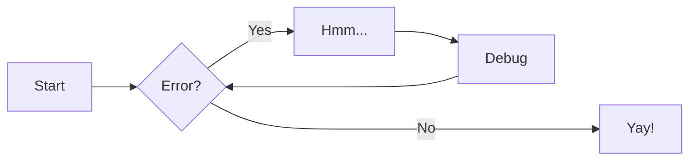

# MkDocs Material but GitHub-Flavored Markdown

This is a simple example of how to use GitHub-Flavored Markdown with MkDocs Material (almost).

📚 Example document: <https://kiyoon.kim/mkdocs-material-github-flavored-template>

## Installation

```bash
pip install -r requirements.txt
```

## Usage

To preview the site,

```bash
mkdocs serve
```

## Features

### Github style callouts (a.k.a. admonitions or alert)

Using [mkdocs-callouts](https://github.com/sondregronas/mkdocs-callouts) and additional admonitions (IMPORTANT, CAUTION) in [docs/stylesheets/extra_admonitions.css](docs/stylesheets/extra_admonitions.css).

See how it renders in the documentation!

```md
> [!NOTE]
> This is a NOTE type alert.

> [!TIP]
> This is a TIP type alert.

> [!WARNING]
> This is a WARNING type alert.

> [!IMPORTANT]
> This is an IMPORTANT type alert.

> [!CAUTION]
> This is a CAUTION type alert.
```
    


### Latex math equations

Using MathJax defined in [docs/javascripts/mathjax.js](docs/javascripts/mathjax.js).

```latex
$a^2 + b^2 = c^2$

$$
\begin{align*}
\dot{x} & = \sigma(y-x) \\
\dot{y} & = \rho x - y - xz \\
\dot{z} & = -\beta z + xy
\end{align*}
$$
```

$a^2 + b^2 = c^2$

$$
\begin{align*}
\dot{x} & = \sigma(y-x) \\
\dot{y} & = \rho x - y - xz \\
\dot{z} & = -\beta z + xy
\end{align*}
$$

### Flowchart with mermaid

````md

````


### Automatic API reference pages

Using [gen-files](https://github.com/oprypin/mkdocs-gen-files) and [literate-nav](https://github.com/oprypin/mkdocs-literate-nav). Basically [scripts/gen_ref_nav.py](scripts/gen_ref_nav.py) will generate `reference/SUMMARY.md` file and then add to the navigation menu when you build it.

Relevant configuration in [mkdocs.yml](mkdocs.yml):

```yaml
nav:
  # defer to gen-files + literate-nav
  - API reference:
      - mkdocstrings-python: reference/

plugins:
  - gen-files:
      scripts:
        - scripts/gen_ref_nav.py
  - literate-nav:
      nav_file: SUMMARY.md
```

Notice you can add modules to ignore in [scripts/gen_ref_nav.py](scripts/gen_ref_nav.py) by adding to `IGNORE_MODULES_*` set.

```python
IGNORE_MODULES_EXACT = {"my_project.my_module"}
IGNORE_MODULES_STARTSWITH = {"my_project.cli."}
```

### Versioning

When publishing a new version, the older versions will be archived with [Mike](https://github.com/jimporter/mike).


The `gh-pages` branch will have the following structure:

```
📂 latest/
📂 v0.1.0/
📂 v0.1.1/
📂 v0.2.0/
...
```

### Useful GitHub Actions

- [.github/workflows/check-docs.yml](.github/workflows/check-docs.yml) to check if the documentation builds successfully in PRs.
- [.github/workflows/deploy-docs-on-latest.yml](.github/workflows/deploy-docs-on-latest.yml) to deploy the documentation to GitHub Pages when you push to `main`/`master` branch.
- [.github/workflows/deploy.yml](.github/workflows/deploy.yml) to add a new tag, change [docs/CHANGELOG.md](docs/CHANGELOG.md) based on conventional commits, deploy the documentation while keeping the previous versions, and create a GitHub release.

> [!TIP]
> Notice that you push the documentation to GitLab, because GitLab pages are free. You can use it with GitHub private repositories without the Enterprise plan. See [Setting Up GitLab Pages](https://kiyoon.kim/mkdocs-material-github-flavored-template/latest/mkdocs/gitlab_pages/).
